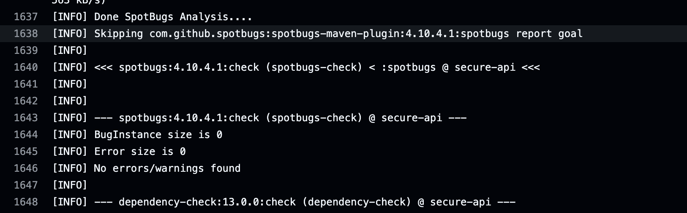
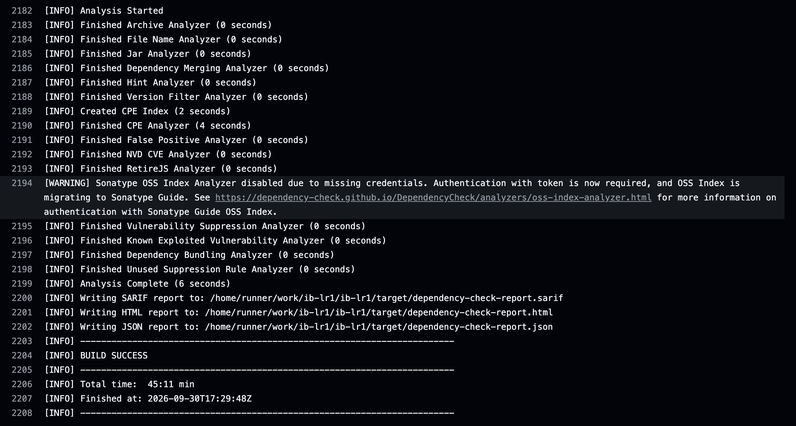

# Лабораторная работа №1 «Разработка защищённого REST API с интеграцией в CI/CD»

Предмет: «Информационная безопасность», НИУ ИТМО, ФПИиКТ.<br>
Выполнил: Шмунк Андрей Александрович, группа P3408.

## Оглавление

- [Инициализация проекта](#инициализация-проекта)
- [Описание проекта](#описание-проекта)
- [Список эндпоинтов](#список-эндпоинтов)
- [Защита от SQL-инъекций](#защита-от-sql-инъекций)
- [Защита от XSS-атак](#защита-от-xss-атак)
- [Реализация аутентификации пользователя](#реализация-аутентификации-пользователя)
- [Полученные отчёты SAST/SCA из Actions](#полученные-отчёты-sastsca-из-actions)

## Инициализация проекта

Для проекта был создан Git-репозиторий, связанный с публичным репозиторием на GitHub.

- Репозиторий: [https://github.com/Gastozavr/ib-lr1](https://github.com/Gastozavr/ib-lr1)
- Последний успешный pipeline: [CI and security checks](https://github.com/Gastozavr/ib-lr1/actions/runs/36746401271)

Workflow запускается при каждом `push` и `pull request` в ветку `main`.

## Описание проекта

В рамках лабораторной работы реализовано REST API с регистрацией пользователей и JWT-аутентификацией. После входа аутентифицированный пользователь может создавать записи, получать список записей и искать их по заголовку.

Приложение написано на Java 21 с использованием Spring Boot 4.1.1, Spring Web MVC, Spring Security и Spring Data JPA. Для хранения данных используется файловая база H2, для сборки — Maven Wrapper. В проекте также используются JJWT 0.13.0 и встроенный сервер Apache Tomcat 11.0.26.

Секрет подписи JWT не хранится в репозитории и передаётся приложению через переменную окружения `APP_JWT_SECRET_BASE64`.

## Список эндпоинтов

### `POST /auth/register` — регистрация

Эндпоинт доступен без JWT. Имя пользователя должно содержать от 3 до 50 символов и состоять из латинских букв, цифр и символов `_`, `-`, `.`. Пароль должен содержать от 12 до 72 символов.

Формат запроса:

```json
{
  "username": "student",
  "password": "StrongPassword1!",
  "displayName": "Student"
}
```

Успешный ответ — `201 Created`:

```json
{
  "id": 1,
  "username": "student",
  "displayName": "Student"
}
```

### `POST /auth/login` — вход

Эндпоинт доступен без JWT. При корректных учётных данных сервер выдаёт JWT со сроком действия 15 минут.

Формат запроса:

```json
{
  "username": "student",
  "password": "StrongPassword1!"
}
```

Формат ответа:

```json
{
  "token": "eyJhbGciOiJIUzI1NiJ9...",
  "type": "Bearer"
}
```

### `GET /api/data` — получение записей

Требует заголовок `Authorization: Bearer <JWT>`. Без параметров возвращает все записи. Необязательный параметр `q` выполняет регистронезависимый поиск по заголовку:

```http
GET /api/data?q=Security
Authorization: Bearer <JWT>
```

Формат ответа:

```json
[
  {
    "id": 1,
    "title": "Security note",
    "content": "Protected content",
    "author": "student"
  }
]
```

### `POST /api/data` — создание записи

Требует заголовок `Authorization: Bearer <JWT>`. Автор определяется по аутентифицированному пользователю и не принимается из тела запроса.

Формат запроса:

```json
{
  "title": "Security note",
  "content": "Protected content"
}
```

Успешный ответ — `201 Created`:

```json
{
  "id": 1,
  "title": "Security note",
  "content": "Protected content",
  "author": "student"
}
```

## Защита от SQL-инъекций

Доступ к базе выполняется через Spring Data JPA и Hibernate. Репозитории наследуются от `JpaRepository`, а пользовательские значения передаются отдельно от SQL-запроса как связанные параметры. Конкатенация SQL-строк с пользовательским вводом в проекте не используется.

Для поиска применяются методы репозиториев:

```java
Optional<UserAccount> findByUsername(String username);
List<Post> findByTitleContainingIgnoreCaseOrderByIdAsc(String title);
```

Интеграционный тест отправляет в форму входа строку `' OR '1'='1` и проверяет получение ответа `401 Unauthorized`, то есть такая строка не позволяет обойти аутентификацию.

## Защита от XSS-атак

Приложение является REST API и возвращает данные в формате JSON. Поля `displayName`, `title` и `content` перед сохранением проходят серверное экранирование методом `HtmlUtils.htmlEscape`. Поэтому HTML-теги и обработчики событий сохраняются и возвращаются как текст, а не как исполняемая разметка.

Дополнительно реализованы следующие меры:

- Bean Validation ограничивает формат и длину входных полей;
- Content Security Policy имеет значение `default-src 'none'`;
- заголовок `X-Frame-Options` запрещает встраивание ответа во frame;
- внутренние сообщения исключений и stack trace не возвращаются клиенту;
- интеграционный тест проверяет экранирование тегов `<script>` и ``.

## Реализация аутентификации пользователя

После успешного запроса `POST /auth/login` сервер выдаёт JWT access-токен. Токен содержит имя пользователя в `subject`, идентификатор издателя, время выдачи и срок действия 15 минут.

На защищённых эндпоинтах фильтр `JwtAuthenticationFilter`:

1. проверяет наличие и формат заголовка `Authorization: Bearer <JWT>`;
2. проверяет HMAC-подпись, издателя и срок действия токена;
3. загружает пользователя из базы данных;
4. устанавливает аутентификацию в `SecurityContext`.

Сервер работает без HTTP-сессий (`SessionCreationPolicy.STATELESS`). Повреждённый, подделанный или просроченный JWT не даёт доступ к защищённым ресурсам.

Пароли сохраняются только в виде BCrypt-хэшей с cost factor 12. Исходные пароли не сохраняются и не логируются. JWT подписывается HMAC-ключом длиной не менее 256 бит, получаемым из `APP_JWT_SECRET_BASE64`.

## Полученные отчёты SAST/SCA из Actions

Успешный запуск тестов и security-проверок: [GitHub Actions run #5](https://github.com/Gastozavr/ib-lr1/actions/runs/36746401271).

### Отчёт SAST — SpotBugs

SpotBugs завершил анализ без ошибок и предупреждений.



### Отчёт SCA — OWASP Dependency-Check

OWASP Dependency-Check завершил проверку с порогом `failBuildOnCVSS = 9.0`. Критические уязвимости, ранее обнаруженные в зависимостях Spring и Apache Tomcat, устранены обновлением Spring Boot до 4.1.1 и Apache Tomcat до 11.0.26 без необоснованных suppression-правил.


